# 📄 Answer Script Parser and Segmentation

> Computer vision-based parser for handwritten examination answer scripts with automatic question detection and segmentation using connected component analysis.

[](https://www.python.org/downloads/)
[](https://opencv.org/)
[](https://opensource.org/licenses/MIT)

## 🎯 Features

- ✅ **Automatic Question Detection** - Uses connected component analysis to detect handwritten question markers
- ✅ **Multi-Page Support** - Handles answers spanning multiple pages seamlessly
- ✅ **Text & Diagram Classification** - Automatically identifies text regions and diagrams
- ✅ **Visual Debugging** - Detailed visualizations showing detection steps
- ✅ **Robust Detection** - Multiple filtering criteria for accurate marker detection
- ✅ **JSON Export** - Structured metadata for each detected question
- ✅ **Individual Question Extraction** - Saves each answer with text and diagrams separately

## 📋 Table of Contents

- [Installation](#-installation)
- [Quick Start](#-quick-start)
- [How It Works](#-how-it-works)
- [Output Structure](#-output-structure)
- [Configuration](#️-configuration)
- [Troubleshooting](#-troubleshooting)
- [Examples](#-examples)
- [Use Cases](#-use-cases)

## 🚀 Installation

### Prerequisites

1. **Python 3.7+**
```bash
python --version
```

2. **Poppler (for PDF conversion)**

**Ubuntu/Debian:**
```bash
sudo apt-get update
sudo apt-get install poppler-utils
```

**macOS:**
```bash
brew install poppler
```

**Windows:**
- Download from [Poppler Windows](http://blog.alivate.com.au/poppler-windows/)
- Add to PATH

### Python Dependencies

```bash
pip install opencv-python numpy pdf2image pillow
```

Or use requirements.txt:
```bash
pip install -r requirements.txt
```

### requirements.txt
```
opencv-python>=4.5.0
numpy>=1.19.0
pdf2image>=1.14.0
Pillow>=8.0.0
```

## 🏁 Quick Start

1. **Clone the repository**
```bash
git clone https://github.com/yourusername/answer-script-parser.git
cd answer-script-parser
```

2. **Place your PDF file**
```bash
# Rename your answer script PDF to answer_script.pdf
# Or modify the pdf_path in the code
```

3. **Run the parser**
```bash
python answer_script_parser.py
```

4. **Check the output**
```bash
cd parsed_output
ls -R
```

## 🔍 How It Works



```mermaid
graph LR
    A[PDF Input] --> B[Convert to Images]
    B --> C[Extract Margins]
    C --> D[Binary Thresholding]
    D --> E[Connected Components]
    E --> F[Filter Components]
    F --> G[Build Answer Spans]
    G --> H[Detect Regions]
    H --> I[Classify Text/Diagrams]
    I --> J[Save Results]
```

### Step-by-Step Process

1. **PDF Conversion** - Converts PDF pages to high-resolution images (300 DPI)
2. **Margin Extraction** - Isolates left margin containing question numbers
3. **Preprocessing**:
   - Adaptive thresholding for binary conversion
   - Morphological operations to clean noise
   - Component dilation to connect number parts
4. **Connected Component Analysis** - Identifies all ink blobs in margin
5. **Filtering Criteria** - Selects question markers based on:
   - Area (500-8000 pixels)
   - Aspect ratio (0.2-4.0)
   - Density (>0.15)
   - Height (20-200 pixels)
6. **Duplicate Removal** - Removes markers within 200px of each other
7. **Answer Span Building** - Creates question boundaries across pages
8. **Region Detection** - Finds text and diagram regions using contours
9. **Classification** - Uses edge detection and line analysis to classify regions

## 📁 Output Structure

```
parsed_output/
│
├── margins/                                # 🔍 Component Detection Debugging
│   ├── page_1_margin_gray.png             # Grayscale margin
│   ├── page_1_binary.png                  # Binary thresholded margin
│   ├── page_1_all_components.png          # 🔴 RED=all components with areas
│   └── page_1_detected.png                # 🟢 GREEN=filtered question markers
│
├── visualization/                          # 📊 Full Page Visualization
│   └── page_1_detection.png               # Questions marked on full page
│
├── questions/                              # 📝 Extracted Questions
│   ├── Q1/
│   │   ├── full_answer.png                # Complete answer image
│   │   ├── text_1.png                     # Text region 1
│   │   ├── text_2.png                     # Text region 2
│   │   ├── diagram_1.png                  # Diagram 1
│   │   └── metadata.json                  # Question metadata
│   ├── Q2/
│   │   ├── full_answer.png
│   │   ├── text_1.png
│   │   └── metadata.json
│   └── Q3/
│       ├── full_answer.png
│       ├── text_1.png
│       ├── diagram_1.png
│       └── metadata.json
│
├── pages/                                  # 📄 Original PDF Pages
│   ├── page_1.png
│   ├── page_2.png
│   └── page_3.png
│
└── summary.json                            # 📋 Complete Results Summary
```

### Understanding Visualizations

**margins/page_X_all_components.png:**
- 🔴 **Red boxes** = All detected ink components
- **Numbers on boxes** = Component area in pixels

**margins/page_X_detected.png:**
- 🟢 **Green boxes** = Filtered question markers
- **Q1, Q2, Q3** = Question numbers assigned

**visualization/page_X_detection.png:**
- 🔵 **Blue vertical line** = Margin boundary
- 🟢 **Green horizontal lines** = Question boundaries
- 🟡 **Yellow boxes** = Detected question markers
- 🟣 **Magenta boxes** = Answer regions with Q labels

### metadata.json Structure

```json
{
  "question_number": 1,
  "spans_pages": [1],
  "page_spans": [
    {
      "page": 1,
      "y_start": 100,
      "y_end": 500
    }
  ],
  "text_regions": [
    {
      "filename": "text_1.png",
      "bbox": [50, 100, 800, 200]
    }
  ],
  "diagrams": [
    {
      "filename": "diagram_1.png",
      "bbox": [50, 350, 400, 150]
    }
  ]
}
```

## ⚙️ Configuration

### Basic Usage

```python
from answer_script_parser import AnswerScriptParser

parser = AnswerScriptParser(output_dir="parsed_output")
results = parser.process_pdf(
    pdf_path="answer_script.pdf",
    dpi=300,
    margin_width_ratio=0.08
)
```

### Advanced Configuration

```python
parser = AnswerScriptParser(
    output_dir="custom_output",      # Output directory
    margin_width_ratio=0.10          # Margin width (5-15% of page width)
)

results = parser.process_pdf(
    pdf_path="exam_paper.pdf",
    dpi=400,                          # Higher DPI for better quality (300-600)
    margin_width_ratio=0.12           # Override margin width for this PDF
)
```

### Fine-Tuning Detection Parameters

If detection is not accurate, you can adjust the filtering criteria in the code (line ~128):

```python
# FILTERING for handwritten question numbers
# Area: 500-8000 pixels for handwritten numbers
if not (500 < area < 8000):
    continue

# Aspect ratio: reasonable shape
if not (0.2 < aspect_ratio < 4.0):
    continue

# Density: solid writing
if density < 0.15:
    continue

# Height check: realistic for numbers
if h < 20 or h > 200:
    continue
```

### Parameters

| Parameter | Default | Range | Description |
|-----------|---------|-------|-------------|
| `dpi` | 300 | 150-600 | Image resolution for processing |
| `margin_width_ratio` | 0.08 | 0.05-0.15 | Margin width as % of page width |
| `area_min` | 500 | 200-1000 | Minimum component area in pixels |
| `area_max` | 8000 | 5000-15000 | Maximum component area in pixels |
| `min_vertical_distance` | 200 | 100-300 | Min pixels between questions |

## 🐛 Troubleshooting

### No Questions Detected

**Problem:** No green boxes in `margins/page_X_detected.png`

**Solutions:**

1. **Check component areas** in `margins/page_X_all_components.png`:
   - Look at the area numbers on red boxes over question markers
   - Adjust area range in code (line 128) based on these values

2. **Increase DPI** for larger components:
```python
results = parser.process_pdf(pdf_path, dpi=400)
```

3. **Adjust margin width** if numbers are cut off:
```python
results = parser.process_pdf(pdf_path, margin_width_ratio=0.12)
```

### Too Many False Detections

**Problem:** Green boxes on noise/stray marks

**Solutions:**

1. **Increase minimum area** (line 128):
```python
if not (1000 < area < 8000):  # Changed from 500
```

2. **Tighten aspect ratio** for more circular/square numbers:
```python
if not (0.3 < aspect_ratio < 2.5):  # Changed from 0.2-4.0
```

3. **Increase density threshold**:
```python
if density < 0.25:  # Changed from 0.15
```

### Missing Question Numbers

**Problem:** Some questions not detected

**Solutions:**

1. Check `margins/page_X_all_components.png` - are red boxes on missing numbers?
2. If yes, note their areas and expand the area range
3. If no, increase DPI or check if numbers are in margin

### Wrong Text/Diagram Classification

**Problem:** Text classified as diagram or vice versa

**Solutions:**

The classification uses:
- Edge density
- Line detection (vertical, horizontal, diagonal)
- Aspect ratio

Adjust thresholds in `classify_region()` method (line 345):
```python
# For more diagrams: lower edge_density threshold
if edge_density > 0.15:  # Changed from 0.2
    is_diagram = True

# For fewer diagrams: increase line threshold
if num_lines > 20:  # Changed from 15
    is_diagram = True
```

## 📊 Examples

### Example 1: Simple Answer Script

```python
from answer_script_parser import AnswerScriptParser

parser = AnswerScriptParser(output_dir="output")
results = parser.process_pdf("exam.pdf")

print(f"Detected {results['total_questions']} questions")
for q in results['questions']:
    print(f"Q{q['question_number']}: {len(q['text_regions'])} text, {len(q['diagrams'])} diagrams")
```

**Output:**
```
Detected 5 questions
Q1: 3 text, 0 diagrams
Q2: 2 text, 1 diagrams
Q3: 4 text, 2 diagrams
Q4: 1 text, 0 diagrams
Q5: 5 text, 1 diagrams
```

### Example 2: Batch Processing

```python
import os
from pathlib import Path

parser = AnswerScriptParser()

pdf_folder = Path("exam_papers")
for pdf_file in pdf_folder.glob("*.pdf"):
    print(f"\nProcessing {pdf_file.name}...")
    
    output_dir = f"output/{pdf_file.stem}"
    parser.output_dir = Path(output_dir)
    parser.output_dir.mkdir(parents=True, exist_ok=True)
    
    results = parser.process_pdf(str(pdf_file), dpi=300)
    print(f"✓ Found {results['total_questions']} questions")
```

### Example 3: Extract Only Diagrams

```python
parser = AnswerScriptParser()
results = parser.process_pdf("exam.pdf")

# Extract all diagrams
for question in results['questions']:
    q_num = question['question_number']
    diagrams = question['diagrams']
    
    print(f"\nQuestion {q_num}: {len(diagrams)} diagram(s)")
    
    for diagram in diagrams:
        diagram_path = f"parsed_output/questions/Q{q_num}/{diagram['filename']}"
        print(f"  - {diagram_path}")
        # Process diagram (e.g., run object detection, OCR, etc.)
```

### Example 4: Custom Area Filtering

```python
# For answer scripts with very small handwritten numbers
parser = AnswerScriptParser()

# Modify the detection parameters before processing
# (You would do this by editing the code at line 128)
# Change: if not (500 < area < 8000):
# To:     if not (200 < area < 5000):

results = parser.process_pdf("small_handwriting.pdf", dpi=400)
```

## 💡 Use Cases

- 🎓 **Educational Institutions** - Automated digitization of exam papers
- 📊 **Assessment Systems** - Preprocessing for automated grading
- 🔍 **Research** - Analysis of student answer patterns
- 📚 **Archive Systems** - Digitizing historical exam records
- 🤖 **ML Training** - Creating datasets for document analysis
- 🖼️ **Diagram Extraction** - Extracting hand-drawn diagrams for evaluation

## 🎨 How Detection Works

The parser uses **connected component analysis** to find question markers:

1. **Convert to Binary** - Adaptive thresholding separates ink from paper
2. **Find Components** - All connected ink blobs are identified
3. **Measure Properties** - Area, aspect ratio, density calculated
4. **Apply Filters** - Components matching question marker characteristics are kept
5. **Remove Duplicates** - Close-together markers are merged

### Why This Approach?

- ✅ **No OCR Required** - Faster and no external dependencies
- ✅ **Works with Any Numbering** - Doesn't need to read the numbers
- ✅ **Position-Based** - Uses spatial location for question separation
- ⚠️ **Requires Manual Adjustment** - May need area tuning for different handwriting styles

## 🔬 Technical Details

### Connected Component Filtering

The parser filters components based on handwritten number characteristics:

```python
# Typical handwritten number properties at 300 DPI:
Area: 500-8000 pixels       # Size of the ink blob
Aspect Ratio: 0.2-4.0       # Width/Height ratio
Density: >0.15              # Ink coverage in bounding box
Height: 20-200 pixels       # Vertical extent
```

### Text vs Diagram Classification

Classification uses multiple heuristics:

```python
# Diagram indicators:
- High edge density (>0.2)
- Many detected lines (>15)
- Multiple vertical lines (>4)
- Square-ish aspect ratio (0.5-2.0)

# Text indicators:
- Very wide aspect ratio (>5)
- Lower edge density
- Few geometric lines
```


### How to Contribute

1. Fork the repository
2. Create your feature branch (`git checkout -b feature/AmazingFeature`)
3. Commit your changes (`git commit -m 'Add some AmazingFeature'`)
4. Push to the branch (`git push origin feature/AmazingFeature`)
5. Open a Pull Request

## 📜 License

This project is licensed under the MIT License - see the [LICENSE](LICENSE) file for details.

```
MIT License

Copyright (c) 2024

Permission is hereby granted, free of charge, to any person obtaining a copy
of this software and associated documentation files (the "Software"), to deal
in the Software without restriction...
```


## ⭐ Show Your Support

If this project helped you, please give it a ⭐️!
